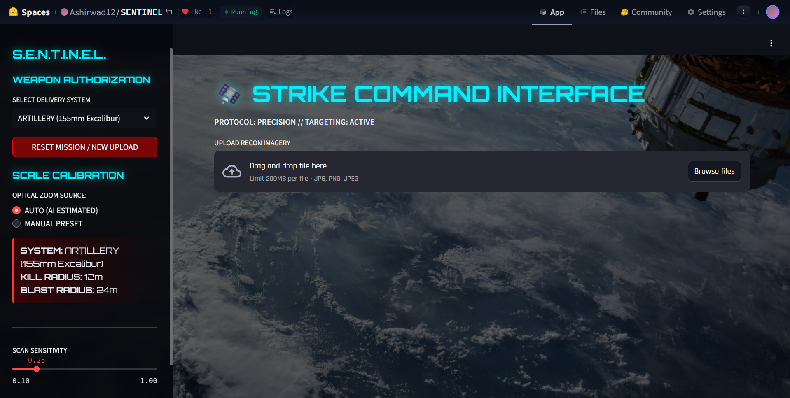

# 🛰️ S.E.N.T.I.N.E.L.
### Strategic Environment & Neural Terrain Intelligence Logic



[](https://huggingface.co/spaces/Ashirwad12/SENTINEL)
[](#)
[](#)

S.E.N.T.I.N.E.L. is an advanced, passive, jam-resistant tactical targeting computer vision platform designed to simulate and evaluate kinetic strikes on aerial and satellite reconnaissance imagery without requiring active radar or laser telemetry. Developed for the IIT BHU "Serve Smart" Hackathon, this system dynamically establishes battlefield scale and target coordinates by evaluating structural signatures of detected military assets.

**Try the live dashboard here:** [S.E.N.T.I.N.E.L. Strike Command Interface](https://huggingface.co/spaces/Ashirwad12/SENTINEL)

---

## 🧠 System Architecture

The ecosystem processes raw reconnaissance imagery across four modular operational layers:
1. **Perception Layer:** Employs a custom-trained YOLOv8-Medium network optimized at high resolutions to accurately classify and bounding-box military equipment, infantry, and civilian assets.
2. **Calibration Layer (Global Scale Engine):** Implements a fallback object taxonomy to parse detections and isolate the most structurally reliable rigid body to dictate the operational scale factor.
3. **Simulation Layer:** References a verified weapon specification database to compute damage estimation, blast thresholds, and optimized impact zones.
4. **Visualization Layer:** A performance-optimized OpenCV workflow that dynamically computes and renders real-time heads-up overlays, scaling kill zones and shockwaves pixel-perfectly onto the input stream.

---

## 🧮 The Mathematical Core

### 1. Auto-Calibration (Hierarchy of Rulers)
To render real-world measurements on arbitrary satellite feeds without spatial metadata, the engine ranks object reliability:

$$\text{Priority Ranking: } P(\text{Warship}) > P(\text{Aircraft}) > P(\text{Tank}) > P(\text{Truck}) > P(\text{Soldier})$$

Organic or pose-variant signatures (like personnel) inherit lower priority weights, while fixed-wing frame spans or combat vessel profiles act as baseline rulers. The isolated configuration establishes a unified global scale coefficient ($S_{global}$):

$$S_{global} = \frac{L_{pixel}}{L_{real}}$$

Where $L_{pixel}$ represents the bounding box's maximum pixel expanse and $L_{real}$ represents the corresponding reference scale from the system's target asset database (e.g., Aircraft = 18.0m).

### 2. Physics-Based Blast Rendering
Explosion boundaries are evaluated through standard destructive metrics rather than arbitrary pixel buffers. The system uses the scale factor to project real-world blast thresholds directly into canvas dimensions:

$$R_{draw} = R_{weapon} \times S_{global}$$

Where $R_{weapon}$ isolates standard structural weapon radii (e.g., a Cruise Missile yield dictates a 45m kill radius, resulting in a strict 90m visual impact diameter). 

### 3. Threat-Weighted Center of Mass Targeting
Rather than targeting isolated coordinates blindly, the automated firing solution assesses tactical distribution profiles by processing cross-sectional threat indexes. The target destination $(I_{x}, I_{y})$ shifts based on object classifications within the drone view space:

$$I_{x} = \frac{\sum(x_{i} \cdot W_{i})}{\sum W_{i}} \quad \text{and} \quad I_{y} = \frac{\sum(y_{i} \cdot W_{i})}{\sum W_{i}}$$

Where $W_{i}$ is the prioritized target coefficient mapping threat levels:
* **Warship:** 15.0
* **Tank:** 10.0
* **Soldier:** 2.0
* **Civilian:** 0.0 (**Hard-Stop Protection Protocol**; civilian entities hold zero weight, ensuring firing vectors do not drag toward non-combatant signatures).

---

## 🎯 Model Training & Pipeline Optimization

The object detection backbone leverages a heavily customized **YOLOv8-Medium** architecture designed to maintain exceptional localization precision over fine-grained inputs.

* **Dataset Optimization (Data Hygiene):** Statistical distribution audits identified severe density disparities among low-sample edge classes (e.g., Trench, Civilian). These categories were pruned, remapping operational classes into a clean, unified structure to eliminate negative gradient transfers.
* **High-Resolution Footprint:** Standard 640px vision input constraints were discarded for a rigid **1024px** footprint. This scaling prevents long-distance features and infantry pixels from collapsing into unresolvable artifact arrays.
* **Relay Race Architecture:** The weights were structured using an iterative checkpointing layout across individual tactical phases ("Legs"). Cyclic learning-rate resets and hyperparameter cooling periods (disabling mosaic distortions during late epochs) allowed the system to bypass optimization valleys, settling at a **0.715 mAP@50** benchmark.
* **Post-Processing Pipeline:** Implements active Test-Time Augmentation (TTA) via scale-inversion flips paired with a strict reverse-mapping ID lookup block to guarantee absolute target schema compliance.
* **Edge Footprint:** The optimized model condenses down to ~50 MB, ensuring fast CPU inference deployment limits are met seamlessly.

---

## 📂 Repository Layout

```text
SENTINEL/
│
├── docs/                                   # Domain Architecture Documentation
│   ├── SENTINEL_Technical_Dossier.pdf      # Complete physics, math, and HUD logic dossier
│   └── High_Res_Detection_Report.pdf       # YOLOv8 relay training analytics report
│
├── notebooks/                              # Isolated Development Checkpoints
│   ├── 01_EDA.ipynb                        # Class frequency & hygiene notebook
│   ├── 02_Training.ipynb                   # 1024px cyclic training configuration
│   ├── 03_Inference.ipynb                  # Test-Time Augmentation validation setup
│   ├── Sentinel_Colabimg.ipynb             # Spatial scaling & coordinate evaluation
│   └── video_collab_notebook.ipynb         # Temporal canvas rendering prototypes
│
├── assets/                                 # Visual Repositories
│   ├── hud.png                             # Active Strike Command HUD Interface
│   └── Report_Assets/                      # Analysis and training plot assets
│       ├── class_distribution.png          
│       ├── image_sizes.png                 
│       ├── object_sizes.png                
│       └── sample_visualization.png        
│
├── app.py                                  # Core Dashboard Application Code
├── requirements.txt                        # Unified Dependency Blueprint
└── README.md                               # Operational Readme File
```

---

<div align="center">

## 👥 Team

**Team Name**: ASHSUM

**Team Members**:

<table>
  <tr>
    <td align="center">
      <br/>
      <a href="https://github.com/ashir1s">Ashirwad Sinha</a>
    </td>
    <td align="center">
      <br/>
      <a href="https://github.com/5umitpandey">Sumit Pandey</a>
    </td>
  </tr>
</table>

</div>
